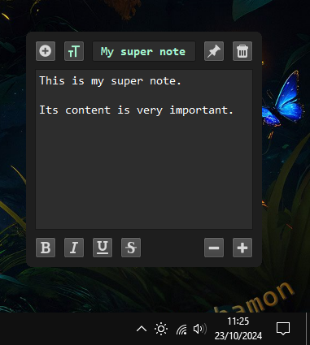

# Qwote

 

## Features

Qwote feature a tray icon. With it you can:

- Create new note
- Set default font
- Delete all opened notes
- Exit

Notes features 4 buttons:

- New button
- Editor tools
- Pin button
- Delete button

Editor tools button will show advanced text controls.

Pin button will keep your notes on top of other windows.

Notes closed with delete button will not be saved / reloaded across app restart.

You can use keyboard shortcuts to adjust font size.

- `ctrl` + `MouseWheelUp`  
Adjust size up (max 16px)

- `ctrl` + `MouseWheelDown`  
Adjust size down (min 8px)

- `ctrl` + `MouseMiddleButtonClick`  
Reset to default size (11px)

## Installation

### Windows 

#### Manual

Download latest release, extract it, and run `Qwote.exe`.

#### Using OdizinnePackageManager

- Install OPM
```
Invoke-Expression (New-Object System.Net.WebClient).DownloadString('https://raw.githubusercontent.com/Odizinne/opm/refs/heads/main/opm_install.ps1')
```

- Install QuickSoundSwitcher 
```
opm update
opm install qwote
```

Qwote will be available in your start menu.

### Linux

Download latest precompiled binary in release section.

## Credits

Using edited icons from [veryicon](https://www.veryicon.com/).