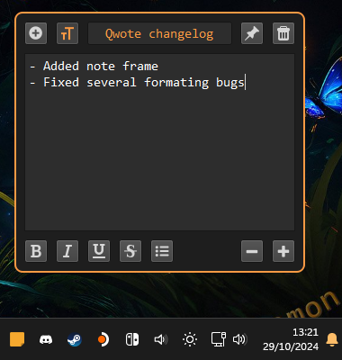

# Qwote

 

## Features

Qwote feature a tray icon. With it you can:

- Create new note
- Set default font
- Delete all opened notes
- Exit

Notes features 4 buttons:

- New button
- Editor tools
- Pin button
- Delete button

Editor tools button will show advanced text controls.

Pin button will keep your notes on top of other windows.

Notes closed with delete button will not be saved / reloaded across app restart.

**Keyboard shortcuts:**

- `ctrl` + `MouseWheelUp`  
Adjust size up (max 16px)

- `ctrl` + `MouseWheelDown`  
Adjust size down (min 8px)

- `ctrl` + `MouseMiddleButtonClick`  
Reset to default size (11px)

- `ctrl` + `N`  
Crate new note

- `ctrl` + `W`  
Delete actual note

- `ctrl` + `E`  
Toggle editor tools

## Installation

### Windows 

Download latest release, extract it, and run `Qwote.exe`.

### Linux

Download latest precompiled binary in release section.

Wayland support is buggy atm.  
Qwote will run using xcb platform plugin.

## Credits

Using edited icons from [veryicon](https://www.veryicon.com/).
