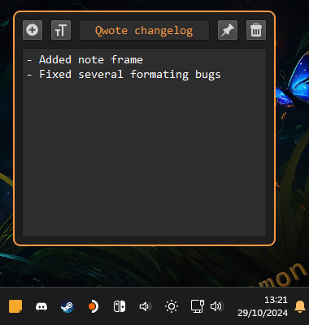

# Qwote

## Manual

Qwote features a tray icon.  
With it you can create new notes or exit the app.

Notes features 3 buttons:

- New button
- Pin button
- Delete button

Pin button will keep your notes on top of other windows.

Notes closed with delete button will not be saved / reloaded across app restart.

